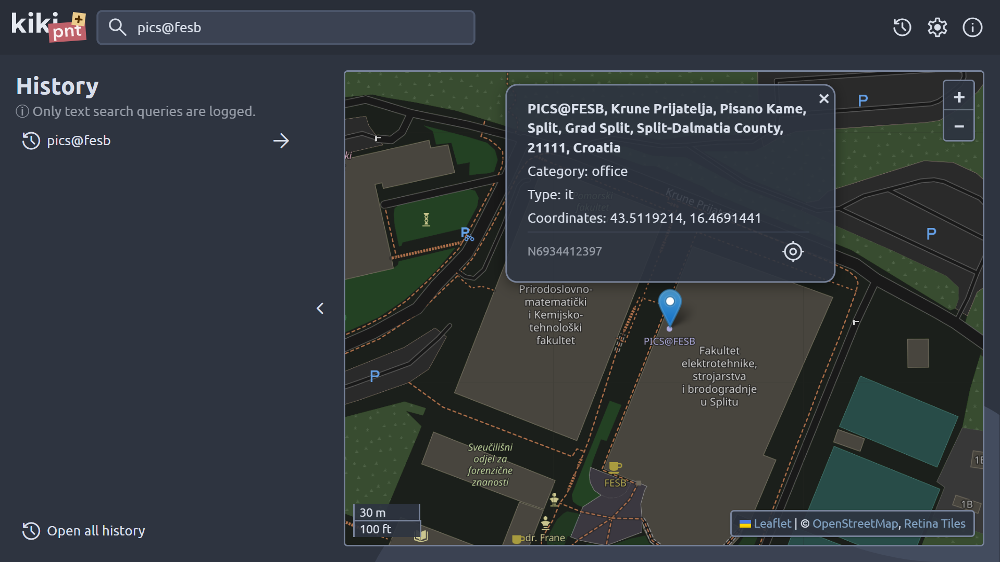

    English | <a href="./README_hr.md">hrvatski</a>

    
      
    <b>kikipnt+</b>
     
    a maintained version of the <a href="https://github.com/kresimirko/kikipnt">kikipnt</a> project

---

:link: **Check it out running live:** [kikipnt+](https://kresimirko.github.io/kikipnt-plus/#/)

---

:pushpin: **kikipnt+** (pronounced "kiki point plus") **is a web app for looking up places of the world**. Powered by [OpenStreetMap](https://www.openstreetmap.org/).

Inspired by [this](https://github.com/ful1e5/Bibata_Cursor#what-does-bibata-mean), I decided to take "kiki" from "kikiriki" (Croatian word for "peanuts") and add "pnt", a shortened version of "point". That's how I got the name **kikipnt**. Then, at the end, I added a plus.

The project files themselves are in the [kikipnt](./kikipnt/) directory.

**Note:** For colored comments in the source code, I recommend the [Better Comments](https://marketplace.visualstudio.com/items?itemName=aaron-bond.better-comments) Visual Studio Code extension.

## :keyboard: Building and running

(Working directory has to be [kikipnt](./kikipnt/).)

If you want the Retina Tiles to work, you have to specify your own key as an environment variable or put it inside .env. Regardless, the name should be `API_KEY_RETINA_TILES`.

`npm install` - install all the necessary packages (check the [dependency graph](https://github.com/kresimirko/kikipnt/network/dependencies) for a list)

`npm run dev` - build and run the development version

`npm run prod` - build and run the production version

### Manual

#### Development

`npx parcel --no-hmr`

#### Production

`npx parcel build --no-source-maps --public-url ./`

## :page_with_curl: Repository resources

[:page_facing_up: Changelog](./CHANGELOG.md)

[:memo: Todo](./TODO.md)

[:framed_picture: Screenshots](./screenshots/)

## :hammer_and_wrench: Credits

### Dependencies

Check the [dependency graph](https://github.com/kresimirko/kikipnt/network/dependencies).

### App resources

[Ubuntu font](https://fonts.google.com/specimen/Ubuntu/)

[Gantari font](https://fonts.google.com/specimen/Gantari)

[Material Symbols](https://fonts.google.com/icons/)

[SVG spinners](https://github.com/n3r4zzurr0/svg-spinners/)

### Tools

[Visual Studio Code](https://code.visualstudio.com/)

[Inkscape](https://inkscape.org/)

[Adobe Illustrator](https://www.adobe.com/products/illustrator.html)

### Other resources

Answers from [Stack Overflow](https://stackoverflow.com/) (necessary attributions are in the source code as comments)

[MDN Web Docs](https://developer.mozilla.org/en-US/)

## Licenses

MIT and BSD 2-Clause

Check the [LICENSE file](./LICENSE.txt) for more details.

---

    Made by <a href="https://kresimirko.github.io">Luka Krešimir Mihovilović</a> with &#128156;

